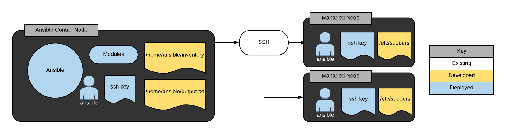

# Getting started with ansible

In this lab, following sceaniro will be created and make sure that it is working. The representation of the scenario is given below: 





Imagine a case where you have one control node and two worker nodes as shown above, in this case we would like to have ssh connection between control node and workder nodes in order to execute ansible commands over worker nodes. This lab is most basic one which is targeting to setup connection. 

In order to make the communication between nodes following instructions should be followed. 

Create ssh key using `ssh-keygen` and copy that key to node1 and node2 as follows

```bash 

$ ssh-keygen
$ ssh-copy-id node1 
$ ssh-copy-id node2 

```

Make sure that you have ssh connection through shared keys, afterwards install ansible on control node and add passwordless option to the user that you would like to use in worker nodes when you are using ansible instructions.

```bash 
$ sudo visudo 
ansible  ALL = (ALL)  NOPASSWD: ALL
```
Add following instruction to `visudo` file, (an example in the visudo can be found for wheel user), change username according to your setting. 

Repeat the process for the node which you are targeting to execute Ansible commands. 

Afterwards, an example command can be run from control node, (- assuming ansible is already installed to control node- )

```bash
$ ansible -i inventory-file node1 -m ping 
```

If the command is successfull, it means the connection between controller node and worker nodes sucessfully established. Now, time to write more advanced playbooks and run over worker nodes, however it will be covered in another lab. 

