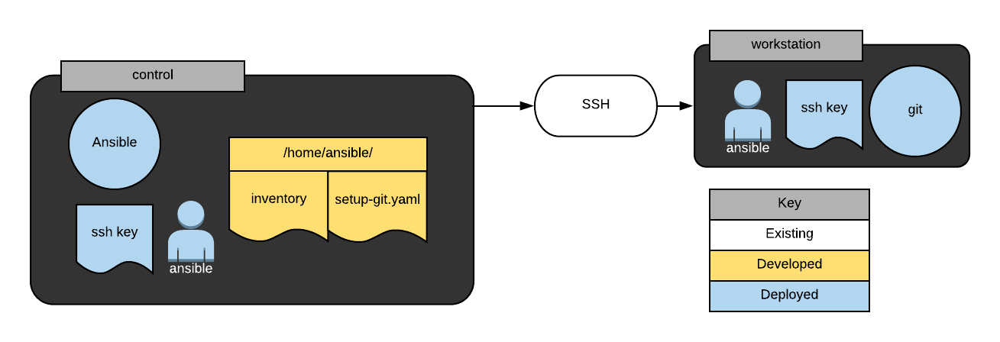

# Lab Task 

You have been tasked with putting together a presentation to demonstrate how Ansible may be used to install software on remote hosts automatically. Before the demo, you will need to configure your test systems. You have been provided two hosts called control and workstation. You will need to configure the ansible user on workstation to have sudo access without a password to the automated software installed via Ansible. You must also configure the control host as your Ansible control server by installing Ansible on it as well as configuring the Ansible user with a pre-shared key to login to the workstation host as the ansible user.





Once the basic configuration is complete, you will need to create a simple inventory in /home/ansible/inventory on the control server containing the workstation host. Afterward, you will write a simple playbook in /home/ansbile/git-setup.yml on the control host that installs git on the workstation host. You will need to make sure the playbook works by running it from the control server.

Summary tasks list:

    Install Ansible on the control host.

    Create an ansible user on both the control host and workstation host.

    Configure a pre-shared key for Ansible that allows the user to log in from control to workstation without a password.

    Configure the Ansible user on the workstation host so that Ansible may sudo without a password.

    Create a simple inventory in /home/ansible/inventory consisting of only the workstation host.

    Write and execute an Ansible playbook in /home/ansible/git-setup.yml on the control node that installs git on the workstation host.


# Objectives

Successfully complete this lab by achieving the following learning objectives:
Install Ansible on the control host.

Run the following commands on the control host:

```bash
sudo yum install epel-release
sudo yum install ansible
```

Create an `ansible` user on both the control host and workstation host being sure to set a password you can remember.

On each host, run the noted commands below. Make sure you set a password you can remember (you will need it later).

Assuming you are logged in as cloud_user:
```bash 
sudo useradd ansible
sudo passwd ansible
```

Configure a pre-shared key for Ansible that allows the user to log in from `control` to `workstation` without a password.

Assuming you are logged into control as cloud_user, run the following commands providing the appropirate passwords when prompted and default options otherwise:
```bash 
sudo -i -u ansible (provide cloud_user a sudo password)

ssh-keygen (accept default options by pressing enter )

ssh-copy-id workstation (provide ansible user a password)

logout
```
Configure the Ansible user on the workstation host so that Ansible may sudo without a password.

    Log into the workstation host as cloud_user and run the following commands:
   
    sudo visudo
    

    Add text at the end of the file that is opened:
    ansible ALL=(ALL) NOPASSWD: ALL
    Save file:
    (:wq in vim)

Create a simple inventory in `/home/ansible/inventory` consisting of only the `workstation` host.

    On the control host as the ansible user run the following commands:

    vim /home/ansible/inventory (note: you may use any text editor with which you are comfortable)

    Add the text "workstatison" to the file and save using (:wq in vim).

Write an Ansible playbook in `/home/ansible/git-setup.yml` on the control node that installs `git` on `workstation` then execute the playbook.

    On the control host as the ansible user run the following commands:
    `vim /home/ansible/git-setup.yml` (You may use any text editor with which your are comfortable.)

    Add the following text to the file:
 
    --- # install git on target host
    - hosts: workstation
      become: yes
      tasks:
      - name: install git
        yum:
          name: git
          state: latest

    Save (:wq in vim) and quit the text editor.

    Run ansible-playbook -i /home/ansible/inventory /home/ansible/git-setup.yml