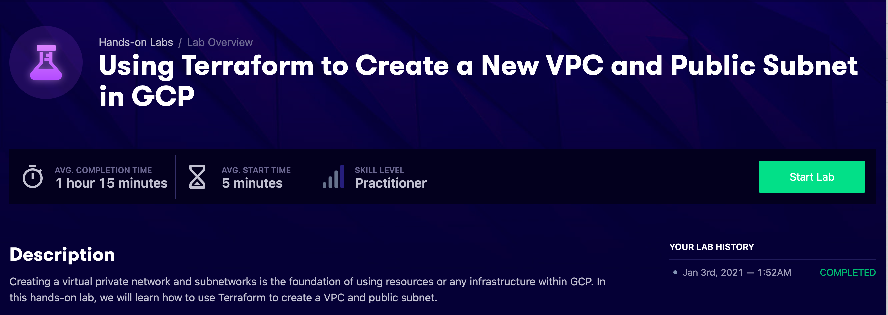
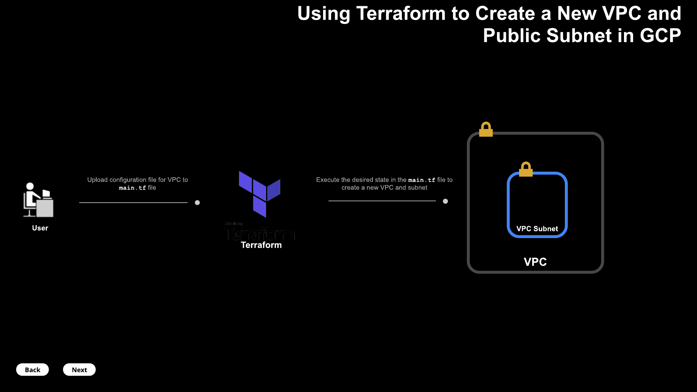

# Lab Diagram




# Steps 

- __terraform init__
  
  ```bash
  [root@terraform-instance downloads]# ./terraform init

    Initializing the backend...

    Initializing provider plugins...
    - Checking for available provider plugins...
    - Downloading plugin for provider "google" (hashicorp/google) 3.5.0...

    Terraform has been successfully initialized!

    You may now begin working with Terraform. Try running "terraform plan" to see
    any changes that are required for your infrastructure. All Terraform commands
    should now work.

    If you ever set or change modules or backend configuration for Terraform,
    rerun this command to reinitialize your working directory. If you forget, other
    commands will detect it and remind you to do so if necessary.
  
  ```
- __terraform validate__
  
  ```bash 
    [root@terraform-instance downloads]# ./terraform validate
    Success! The configuration is valid.
  ```
- __terraform plan__
  
  ```bash 

    [root@terraform-instance downloads]# ./terraform plan
    Refreshing Terraform state in-memory prior to plan...
    The refreshed state will be used to calculate this plan, but will not be
    persisted to local or remote state storage.


    ------------------------------------------------------------------------

    An execution plan has been generated and is shown below.
    Resource actions are indicated with the following symbols:
    + create

    Terraform will perform the following actions:

    # google_compute_network.vpc_network will be created
    + resource "google_compute_network" "vpc_network" {
        + auto_create_subnetworks         = true
        + delete_default_routes_on_create = false
        + gateway_ipv4                    = (known after apply)
        + id                              = (known after apply)
        + ipv4_range                      = (known after apply)
        + name                            = "terraform-network"
        + project                         = (known after apply)
        + routing_mode                    = (known after apply)
        + self_link                       = (known after apply)
        }

    # google_compute_subnetwork.public-subnetwork will be created
    + resource "google_compute_subnetwork" "public-subnetwork" {
        + creation_timestamp = (known after apply)
        + enable_flow_logs   = (known after apply)
        + fingerprint        = (known after apply)
        + gateway_address    = (known after apply)
        + id                 = (known after apply)
        + ip_cidr_range      = "10.2.0.0/16"
        + name               = "terraform-subnetwork"
        + network            = "terraform-network"
        + project            = (known after apply)
        + region             = "us-central1"
        + secondary_ip_range = (known after apply)
        + self_link          = (known after apply)
        }

    Plan: 2 to add, 0 to change, 0 to destroy.

    ------------------------------------------------------------------------

    Note: You didn't specify an "-out" parameter to save this plan, so Terraform
    can't guarantee that exactly these actions will be performed if
    "terraform apply" is subsequently run.

  ```

  - __terraform apply__

    ```bash 
    
    [root@terraform-instance downloads]# ./terraform apply

    An execution plan has been generated and is shown below.
    Resource actions are indicated with the following symbols:
    + create

    Terraform will perform the following actions:

    # google_compute_network.vpc_network will be created
    + resource "google_compute_network" "vpc_network" {
        + auto_create_subnetworks         = true
        + delete_default_routes_on_create = false
        + gateway_ipv4                    = (known after apply)
        + id                              = (known after apply)
        + ipv4_range                      = (known after apply)
        + name                            = "terraform-network"
        + project                         = (known after apply)
        + routing_mode                    = (known after apply)
        + self_link                       = (known after apply)
        }

    # google_compute_subnetwork.public-subnetwork will be created
    + resource "google_compute_subnetwork" "public-subnetwork" {
        + creation_timestamp = (known after apply)
        + enable_flow_logs   = (known after apply)
        + fingerprint        = (known after apply)
        + gateway_address    = (known after apply)
        + id                 = (known after apply)
        + ip_cidr_range      = "10.2.0.0/16"
        + name               = "terraform-subnetwork"
        + network            = "terraform-network"
        + project            = (known after apply)
        + region             = "us-central1"
        + secondary_ip_range = (known after apply)
        + self_link          = (known after apply)
        }

    Plan: 2 to add, 0 to change, 0 to destroy.

    Do you want to perform these actions?
    Terraform will perform the actions described above.
    Only 'yes' will be accepted to approve.

    Enter a value: yes

    google_compute_network.vpc_network: Creating...
    google_compute_network.vpc_network: Still creating... [10s elapsed]
    google_compute_network.vpc_network: Still creating... [20s elapsed]
    google_compute_network.vpc_network: Still creating... [30s elapsed]
    google_compute_network.vpc_network: Still creating... [40s elapsed]
    google_compute_network.vpc_network: Creation complete after 46s [id=projects/using-terraf-156-8b8dd176/global/networks/terraform-network]
    google_compute_subnetwork.public-subnetwork: Creating...
    google_compute_subnetwork.public-subnetwork: Still creating... [10s elapsed]
    google_compute_subnetwork.public-subnetwork: Creation complete after 16s [id=projects/using-terraf-156-8b8dd176/regions/us-central1/subnetworks/terraform-subnetwork]

    Apply complete! Resources: 2 added, 0 changed, 0 destroyed.
    
    ```

## End Result 

